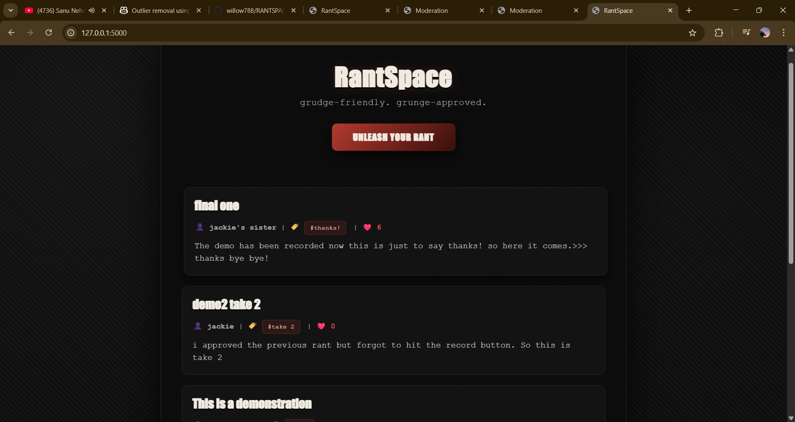

<div align="center">

# 🔥 RANTSPACE 🔥

### *Because sometimes you just need to yell into the void...  and have the void yell back.*


</div>

---

<div align="center">
  
</div>

---

## 🎭 What Even Is This?  

**RANTSPACE** is your digital anger management therapy session gone rogue. It's a web platform where you can unleash your frustrations, read other people's meltdowns, and collectively realize we're all slowly losing it together. 

Think **Reddit** meets a **therapist's notepad** meets a **dumpster fire** 🔥 (in the best way possible).

<div align="center">

```
Built with Flask 🐍 SQLite 💾 and an unhealthy amount of caffeine ☕
```

</div>

---

## ✨ Features That Slap

<table>
<tr>
<td width="50%">

### 📝 Write Rants
Pour your soul (or rage) into the form.  Title it.  Tag it. Post it. Let it all out! 

### 👍 Double-Like System  
Every like counts for **2** because i'm a weirdo

### 🔒 Admin Moderation
Keep the chaos organized with a sleek admin panel to approve or reject rants. 

</td>
<td width="50%">

### 🌑 Dark Mode Only
Because we're edgy like that (and easier on the eyes at 3 AM).

### 🎨 Brutalist Aesthetic
Minimalist dark design with just enough flair to keep things interesting.

### 🐷 Default Username
Don't want to share your name? No problem—**Peppa Pig's** got your back! 

</td>
</tr>
</table>

---

## 🚀 Getting Started

<details open>
<summary><b>📋 Prerequisites</b></summary>

<br>

```bash
python 3.x
flask
sqlite3
```

</details>

<details open>
<summary><b>⚙️ Installation</b></summary>

<br>

**1️⃣ Clone this bad boy**
```bash
git clone https://github.com/willow788/RANTSPACE.git
cd RANTSPACE
```

**2️⃣ Navigate to the main code**
```bash
cd "MAIN CODE/Python code section"
```

**3️⃣ Install dependencies**
```bash
pip install flask
```

**4️⃣ Set your admin password**

Open `app.py` and change the admin password (line 9):
```python
admin_password = "YOUR-SUPER-SECRET-PASSWORD-HERE"
```

**5️⃣ Initialize & run the app**
```bash
python app.py
```
The database will auto-create on first run!  ✨

**6️⃣ Visit the app**

Open your browser and go to:  **`http://localhost:5000`**

**🎉 Start ranting! **

</details>

---

## 🎯 How to Use

<div align="center">

| Route | Description |
|-------|-------------|
| 🏠 **`/`** | Browse all approved rants |
| ✍️ **`/write`** | Create your masterpiece of frustration |
| 💖 **`/like/<id>`** | Like a rant (+2 points!) |
| 🔐 **`/admin`** | Moderate rants (password protected) |

</div>

---

## 🏗️ Project Structure

```
📦 RANTSPACE
┣ 📂 MAIN CODE
┃ ┣ 📂 Python code section
┃ ┃ ┗ 📜 app.py              # Backend magic ✨
┃ ┗ 📂 templates
┃   ┣ 📄 index.html          # Home sweet home
┃   ┣ 📄 write.html          # Rant composer
┃   ┣ 📄 rant.html           # Individual rant view
┃   ┣ 📄 Admin.html          # Moderation panel
┃   ┗ 📄 Admin-login.html    # Admin gate
┣ 📂 Demonstration
┃ ┗ 🖼️ demo.png              # Pretty screenshot
┗ 📜 README.md               # You are here 👋
```

---

## 🎨 Tech Stack

<div align="center">

<table>
<tr>
<td align="center" width="33%">

<br><b>Python + Flask</b>
<br><sub>Backend Logic</sub>
</td>
<td align="center" width="33%">

<br><b>SQLite</b>
<br><sub>Database</sub>
</td>
<td align="center" width="33%">

<br><b>HTML + CSS</b>
<br><sub>Frontend</sub>
</td>
</tr>
</table>

</div>

---

## 🤝 Credits

<table>
<tr>
<td width="50%" align="center">

### 🧙‍♂️ Backend & Python Sorcery

<a href="https://github.com/willow788">
  
  <br>
  <b>@willow788</b>
</a>

<sub>The mastermind behind all the Flask routes, database logic, double-like system, and that Peppa Pig username easter egg.  Also responsible for the admin moderation system and making sure your rants don't crash the server.</sub>

</td>
<td width="50%" align="center">

### 🎨 CSS Styling & Frontend Wizardry


<br>
<b>GitHub Copilot</b>

<sub>Our AI overlord who blessed us with those gorgeous dark gradients, brutalist design patterns, accent colors, shadow effects, and all the visual polish that makes you want to stare at your screen even when you're angry. </sub>

</td>
</tr>
</table>

---

## 🐛 Known "Features"

> 🎯 **Not bugs, just personality quirks**

- ✌️ Likes are worth **2 points** because reasons (see code comments in `app.py` for the *totally professional* explanation)
- 🐷 If you don't enter a username, you become **Peppa Pig**.  Don't ask questions. 
- 🔐 Admin password is hardcoded. Change it or live dangerously.  Your choice.

---
## ⚠️ Community Guidelines

**RANTSPACE** is a place to vent frustrations, not to harm others. 

- ❌ **DO NOT** post anyone's personal or sensitive information (names, addresses, phone numbers, emails, etc.)
- ❌ **DO NOT** doxx, harass, or target specific individuals
- ✅ **DO** keep it anonymous and focus on the situation, not the person
- ✅ **DO** remember:  rant responsibly

**Violators will have their posts removed and may be banned from the platform.**

> *Vent your anger, not someone else's secrets.  Keep it classy(ish).* 🎯

## 📝 License

Do whatever you want with this.  Just don't sue me if your rants get too spicy.  🌶️
BUT DON'T HURT ANYONE!

---

## 🤔 FAQ

<details>
<summary><b>Q: Why does everything look so dark? </b></summary>
<br>
A: Because we're all dead inside. Also, dark mode is superior.  ✨
</details>

<details>
<summary><b>Q: Can I customize the CSS?</b></summary>
<br>
A: Absolutely!  Go wild. Make it pink if you want. I won't judge (much). 💅
</details>

<details>
<summary><b>Q:  What's with the Peppa Pig thing? </b></summary>
<br>
A: Art. Pure art. 🎨
</details>

<details>
<summary><b>Q: Why is each like worth 2 points?</b></summary>
<br>
A: Read the code comments. Or don't. Live in mystery. 🤷
</details>

---

<div align="center">

### 💢 Built with Too Much Coffee

<br>

> *"Your anger is valid. Your rants are hilarious. Welcome to RANTSPACE."*

<br>

**[⭐ Star this repo](https://github.com/willow788/RANTSPACE)** if you've ever rage-typed a message and deleted it

<br>

[](https://flask.palletsprojects.com/)
[](https://www.python.org/)
[](https://www.sqlite.org/)

<br>

**Made with 🔥 by [@willow788](https://github.com/willow788)**

<br>

---

*Got feedback? Want to contribute? Found a bug (or "feature")? Open an issue!*

</div>
